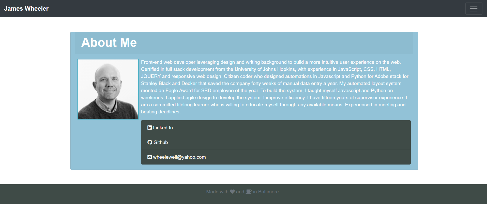
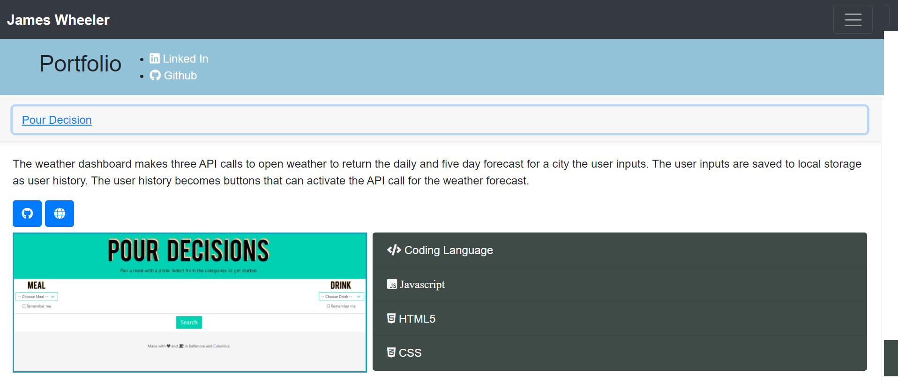

# CSS-Bootstrap-Homework-2
The portfolio website was built with CSS and bootstrap. The website goal is to demonstrate polished design and UI/UX. The page can be found here https://jrtwheeler.github.io/Portfolio/.

- Javascript
- CSS
- HTML
- Bootstrap

